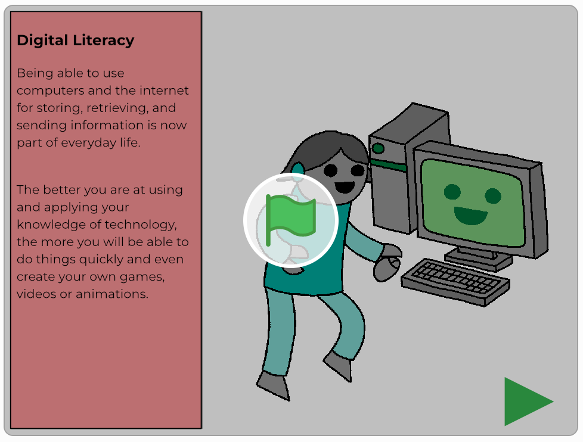

## Starter

There are 3 sections in the Starter:
1. Pre-Module Survey
2. Animation: Skills in careers that involve Computing
3. Game: Skills Sorting

Please make sure you complete all of the activities and tick them off as you complete them.

### 1. Pre-Module Survey

--- task ---

Please complete this pre-module survey before you start the module:

<iframe id="ss-embed-frame-734054" onload="window.scrollTo(0, document.getElementById('ss-embed-frame-734054').offsetTop);" src="https://www.smartsurvey.co.uk/s/HLWGD/" style="width:100%;height:400px;border:0px;padding-bottom:4px;" frameborder="0"><a href="https://www.smartsurvey.co.uk/s/HLWGD/">Please take our survey</a></iframe>

--- /task ---

### 2. Animation: Skills in careers that involve Computing

--- task ---

You can watch the animation as a group or on your own.

As with all activities, tick it off when you have completed it.

Click on the green flag to begin the animation. Remember, when you have finished the animation, click on the 'go back' button on your browser window to come back to this Starter activity:

<a href="https://scratch.mit.edu/projects/325793079">

--- /task ---

### 3. Game: Skills Sorting

--- task ---

If you have a Scratch account click [this link](https://scratch.mit.edu/projects/326271674) to log in and play the Skills Sorting Game. If you don't have a Scratch account, click [this link](https://scratch.mit.edu/projects/326271944) to play the Skills Sorting Game.

Click on the green flag to begin the Skills Sorting game. When you have finished the game, click on the go back button on your browser window to come back to this Starter activity. As with all activities, tick it off when you have completed it.

Don’t forget, you need to work your way through the projects in the order they are listed because that’s the way this module has been designed. You’ll miss some key instructions otherwise :)

--- /task ---

Click on the ‘Click me’ button to go back to the Scratch 2 Module pathway and begin the projects.

<a href="https://codeclub.org/en/projects-cc">

